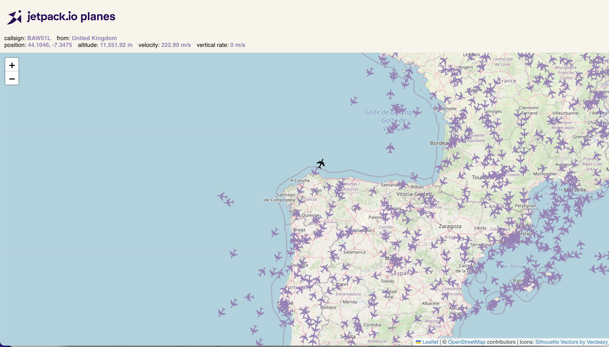
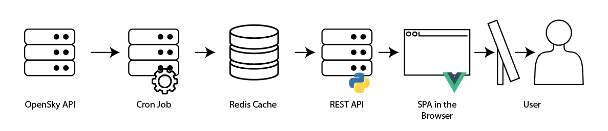

Jetpack.io Planes
=================

This sample app shows how easy it is to get started with Jetpack.io.




## Application Architecture



- Cron job: periodically data is queried from the OpenSky API and written to a Redis data store.

- User Application: an Express API queries data and surfaces it to a Single Page Application (SPA) written in Vue.


## Run with Containers

1. Install [Docker Desktop](https://www.docker.com/products/docker-desktop) if it isn't installed already.

2. Run `docker-compose up` from your favorite terminal.

   This will spin up the Redis data store.

   This will also build and deploy the data loading app that pulls flight data from OpenSky API and loads it into Redis every 10 seconds.

   This will also build and start the REST API on http://localhost:8080.  This app consists of a Python FastAPI that queries the database and a Vue.js app that shows planes on a Leaflet map.

3. Browse to http://localhost:8080/ and watch the planes move.  Click on a plane to see the details.

4. When you're done, hit cntrl-c and run `docker-compose down` to stop all the containers.


## Run locally

1. Start Redis.

   ```sh
   docker-compose -f redis.yaml up
   ```

   Alternatively, you can set `REDIS_URL` to match your existing cluster.

2. Run the cron job.

   ```sh
   cd data-load
   python main.py
   ```

3. Start the API.

   ```sh
   cd api
   python main.py
   ```

4. Start the UI.

   ```sh
   cd app
   npm install --legacy-peer-deps
   npm run serve
   ```

5. Browse to http://localhost:8080/ and watch the planes move.  Click on a plane to see the details.


## License

MIT
